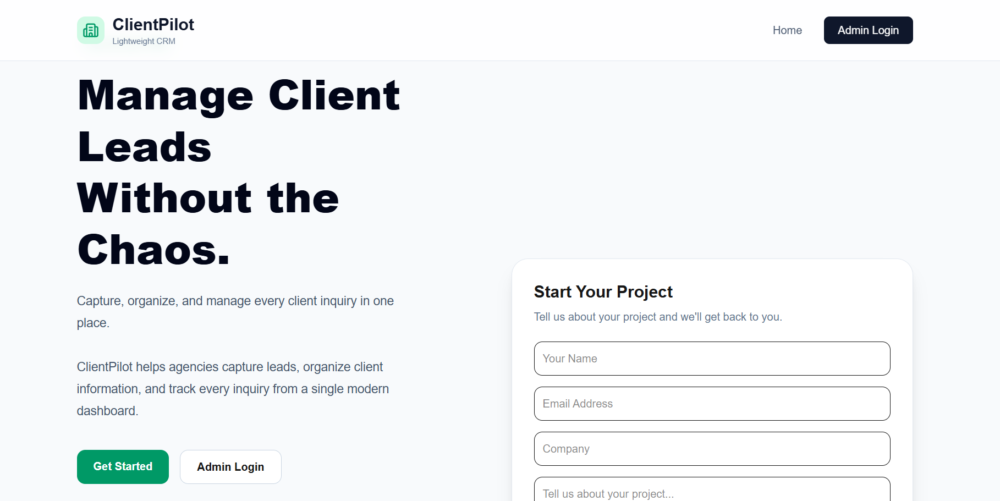
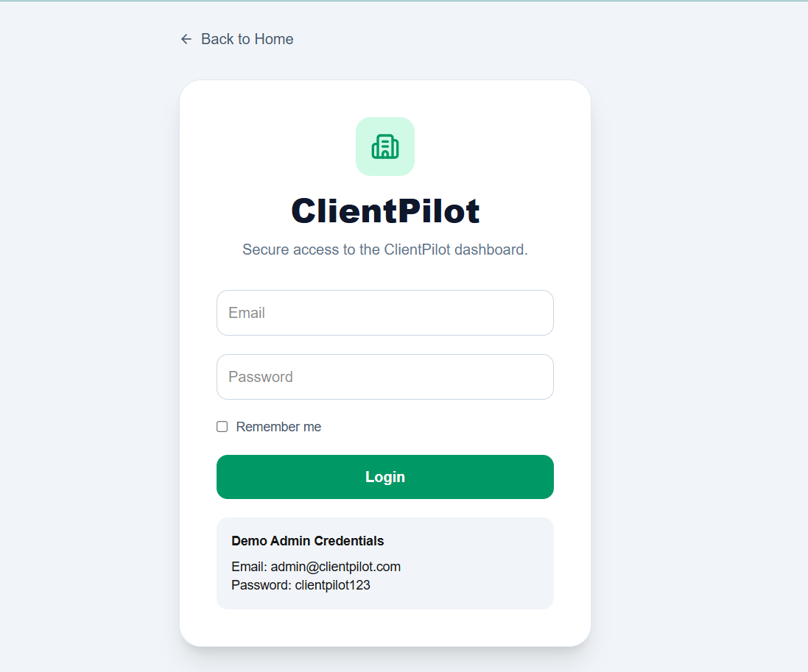
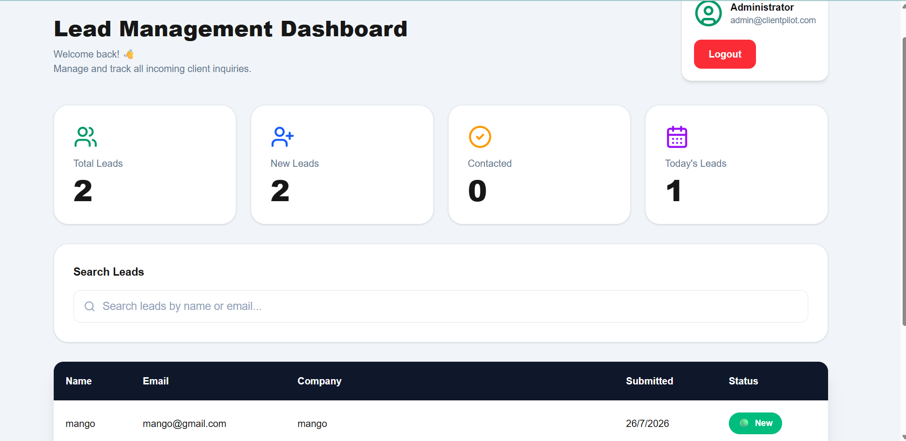

# ClientPilot

A modern lightweight CRM (Customer Relationship Management) application that helps agencies capture, organize, and manage client leads through an intuitive dashboard.


---

## Live Demo

 https://clientpilot-delta.vercel.app/

---

## GitHub Repository

 https://github.com/sasighanta/clientpilot

---

# Features

- Modern SaaS Landing Page
- Lead Capture Form
- Admin Authentication (Cookie-based)
- Protected Admin Dashboard
- Search Leads
- Lead Status Tracking
- Analytics Cards
- Responsive Design
- Toast Notifications
- Prisma ORM Integration
- Supabase PostgreSQL Database

---

# 🛠 Tech Stack

### Frontend

- Next.js 15
- React
- TypeScript
- Tailwind CSS

### Backend

- Next.js Server Actions

### Database

- PostgreSQL
- Supabase
- Prisma ORM

### UI Libraries

- Lucide React
- React Hook Form
- Zod
- Sonner

---

# Demo Login

Email

admin@clientpilot.com

Password

clientpilot123

---

# Screenshots

## Landing Page



---

## Login Page



---

## Admin Dashboard



---

# Environment Variables

Create a `.env` file:

```env
DATABASE_URL=your_database_url

ADMIN_EMAIL=admin@clientpilot.com

ADMIN_PASSWORD=clientpilot123
```

---

# Installation

```bash
git clone https://github.com/sasighanta/clientpilot.git

cd clientpilot

npm install

npm run dev
```

---

# Project Structure

```
src/
│
├── app/
├── actions/
├── components/
├── lib/
├── prisma/
└── middleware.ts
```

---

# Future Improvements

- Email Notifications
- User Authentication
- Team Collaboration
- Lead Notes
- File Attachments
- Export Leads to CSV

---

# Developer

**Sasi Sai Tulasi**

Built as part of the **Digital Heroes Internship Task** using **Next.js**, **Prisma**, and **Supabase**.

---

# License

This project is for educational and internship evaluation purposes.
